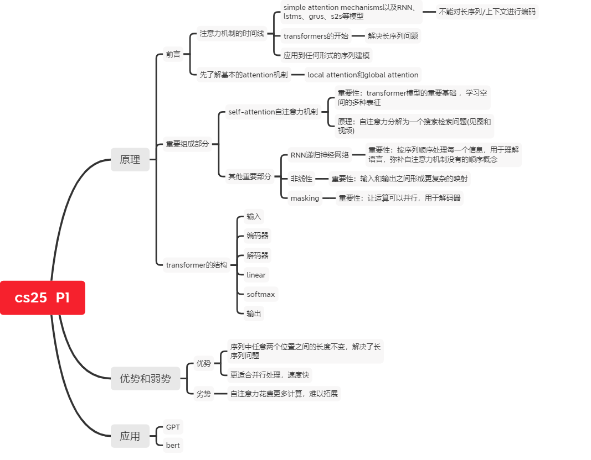

## CS 25 - Notes - V1

CS25: Transformers United (Transformers 合集)
Stanford - Fall 2021

**主题：**

Since their introduction in 2017, transformers have revolutionized Natural Language Processing (NLP). Now, transformers are finding applications all over Deep Learning, be it computer vision (CV), reinforcement learning (RL), Generative Adversarial Networks (GANs), Speech or even Biology. Among other things, transformers have enabled the creation of powerful language models like GPT-3 and were instrumental in DeepMind's recent AlphaFold2, that tackles protein folding.

In this seminar, we examine the details of how transformers work, and dive deep into the different kinds of transformers and how they're applied in different fields. We do this through a combination of instructor lectures, guest lectures, and classroom discussions. We will invite people at the forefront of transformers research across different domains for guest lectures.

自 2017 年问世以来，transformers已经彻底改变了自然语言处理（NLP）。现在，transformers的应用遍及深度学习领域，无论是计算机视觉（CV）、强化学习（RL）、生成对抗网络（GAN）、语音甚至生物学。除其他外，transformers还帮助创建了 GPT-3 等强大的语言模型，并在 DeepMind 最近开发的 AlphaFold2 中发挥了重要作用，该模型用于处理蛋白质折叠问题。

在本讲座中，我们将研究transformers的工作细节，深入探讨不同类型的transformers及其在不同领域的应用。我们将通过教师讲课、嘉宾讲座和课堂讨论相结合的方式来实现这一目标。我们将邀请在不同领域处于变压器研究前沿的人士做客座讲师。

## 「V1-01」Transformers介绍（Introduction to Transformers）
推荐阅读: 
1）Attention Is All You Need 「此篇论文可以说是整个大语言模型的开端」
2）The Illustrated Transformer
3）The Annotated Transformer 

### 一、本节内容整体介绍

#### 1.0 本节思维导图

#### 1.1. 课程介绍
- 课程由Advay、Chetanya和Div三位讲师共同教授。
- Advay是Applied Intuition公司的软件工程师，曾是斯坦福大学计算机科学硕士生。
- Chetanya是斯坦福大学的博士生，曾在生成模型、强化学习和机器人学方面进行研究。
- Div是Moveworks公司的机器学习工程师，曾是斯坦福大学NLP专业的硕士生，也是赢得Alexa Prize Challenge的斯坦福团队成员。

#### 1.2. Transformers的介绍
- Transformers的核心是注意力机制，这一概念最早在2017年的论文《Attention is All You Need》中提出。
- 2017年之前，主要使用的是RNN、LSTM等模型，但这些模型在编码长序列和上下文方面存在不足。
- Transformers的出现标志着从“史前时代”到现代深度学习模型的转变。
- Transformers已被应用于多个领域，如蛋白质折叠、强化学习、文本和图像生成等。

#### 1.3. 注意力机制的演变
- 最初的注意力机制受到人类对图像重要部分的关注的启发。
- 软注意力和硬注意力是两种基本的注意力机制，但存在计算成本高和不可微分等问题。
- 自注意力（self-attention）是Transformers的基础，它将查询（query）、键（key）和值（value）的概念引入模型中。
- 多头自注意力（Multi-head self-attention）允许模型在不同的表示空间中学习，每个头可以关注不同的语义信息。

#### 1.4. Transformers的优势和局限性
- 优势包括序列中任意两点之间的恒定路径长度和对并行计算的良好适应性。
- 局限性在于自注意力操作的计算复杂度为二次方，难以扩展到大规模数据。

#### 1.5. 应用案例
- GPT系列模型（由OpenAI发布）仅包含Transformers的解码器部分，用于语言模型任务和生成任务。
- BERT模型（Bidirectional Encoder Representations from Transformers）仅包含编码器部分，通过Masked Language Modeling和Next Sentence Prediction任务进行预训练。

#### 1.6. 结语
- 课程还包括许多其他精彩的视频和演讲者，希望观众能够从中获得价值。

#### 1.7. 总结
这篇文档详细介绍了Transformers模型的历史、关键概念、优势、局限性和应用案例。Transformers模型已经成为深度学习领域的一个重要里程碑，对于理解和研究自然语言处理、计算机视觉等任务具有重要意义。

### 二、课程内容笔记 [原文+注释]「当前缺配图」

#### 2.1 课程介绍
大家好，欢迎来到斯坦福大学 CS25 transformers united的第一堂简介课程。CS25 是我们三个人在 2021 年秋季在斯坦福创建并教授的一门课程。而这门课的主题并不像图片可能暗示的那样，它不是关于可以变成汽车的机器人「变形金刚」。而是关于深度学习模型，具体来说是一种革命性的深度学习模型，从自然语言处理到计算机视觉，再到强化学习等多个领域都产生了革命性影响。

*「注释：这里提到的transformers united指的是课程的名称，它与深度学习模型transformer相关，而不是指电影中的机器人变形金刚。深度学习模型transformer是一种在多种机器学习任务中都非常有效的算法结构。」*

我们为您准备了一系列令人兴奋的视频，我们也邀请了一些真正出色的演讲者来分享他们如何在自己的研究中应用transformer。我们希望您会喜欢并从这些演讲中学到东西。这个视频纯粹是一堂关于transformer的简介课程。

基本上，希望你通过观看这些视频能够学到三件事。
首先，希望你能够理解 Transformer 的工作原理。
其次，我们希望你能够学习，并在这些讲座结束时理解 Transformer 如何应用于自然语言处理以外的领域。
第三，我们希望这些讲座能在你们中间激发一些新思想，希望能导致研究的新方向、新类型的创新以及类似的事物。
首先，我们将稍微谈谈transformer，并介绍一些transformer背后的背景。

*「注释：这段概述了课程的三个学习目标，旨在不仅让学生理解transformer的工作原理，还要能够将其应用于不同领域，并激发创新思维。」*

#### 2.2 transformer的历史

[PPT图片]

欢迎来到我们的transformer研讨会，我将首先概述注意力时间线以及其形成的过程。transformer的关键思想是2017年开发的自注意力机制。这一切都始于一篇名为《Attention is All You Need》的论文，作者是Vohaswani等人。

*「注释：注意力时间线指的是自注意力机制及其相关概念的发展历史。《Attention is All You Need》是一篇开创性的论文，它首次提出了transformer模型。」*

[PPT图片]

在2017年之前，我们处于一个前史时期，那时我们有更旧的模型，如RNNs、LSTMs和更简单的注意力机制。最终，transformer在其他领域的增长已经爆炸性增长，并在机器学习的所有领域中变得突出。我将去看并展示这是如何被使用的。所以在前史时期，曾经有RNNs。有不同的模型，如序列到序列、LSTMs、GRUs。它们擅长编码某种记忆，但在编码长序列方面效果不佳，并且在编码上下文方面表现非常糟糕。

*「注释：前史时期指的是在transformer模型出现之前的时间，RNNs、LSTMs和GRUs是那时常用的循环神经网络模型，它们在处理序列数据时有一定的局限性。」*

[PPT图片]

因此，这里举个例子，如果你有一个句子，比如说：“我在法国长大....，所以我会说流利的法语”这样的句子。

然后你想根据上下文填充这个中间的破折号，但是一个LSTM模型可能不知道这是什么，可能会在这里犯一个非常大的错误。同样，我们可以在这里展示某种相关性映射，如果你有一个像“它”这样的代词，我们希望它与我们迄今为止看到的过去名词（如“动物”）相关联。但是，旧模型在这种上下文编码方面表现非常糟糕。

*「注释：这段说明了旧模型在处理语言的上下文相关性方面的不足，而transformer模型通过自注意力机制显著改进了这一点。」*

所以我们目前所处的位置正处在起飞的边缘。我们开始意识到transformer在不同领域的潜力。我们已经开始使用它们来解决蛋白质折叠等长序列问题，比如DeepMind的alpha-fold模型，在离线RL的不同挑战中达到95%的准确率。我们可以将其用于少样本和零样本泛化，用于文本和图像生成。我们也可以将其用于内容生成。

*「注释：这段描述了transformer模型在多个领域的应用潜力，包括生物学、强化学习和内容创作等。」*

这里有一个来自OpenAI的例子，你可以提供不同的文本提示，然后AI生成器就会为你创作一个虚构的图像。还有一个关于这个话题的讲座，你也可以在YouTube上观看，基本上是说LSTMs已经过时了，transformers才是未来。

*「注释：OpenAI的AI生成器展示了transformer模型在图像生成方面的应用，而LSTMs与transformers的比较指出了后者在当前研究和应用中的主导地位。」*

那么未来会是什么样子呢？我们可以让transformers应用于更多的应用场景。它们可以应用于任何形式的序列建模，我们可以将它们用于视频理解。我们可以将它们用于金融等等，基本上想象一下各种生成建模问题。

*「注释：这段话展望了transformers在未来可能的应用范围，强调了它们的灵活性和适用性。」*

然而，还有很多缺失的要素。就像人类大脑一样，我们需要一种外部记忆单元，对我们来说就是海马体。这方面也有一些早期的工作。一个你可能想看看的好作品叫做神经调谐机。同样，当前的注意力机制在时间上非常复杂，并且在规模上呈二次增长，我们稍后会讨论这一点。我们希望让它们变得更线性。第三个问题是，我们希望将我们当前的语言模型与人类大脑的工作方式和人类价值观相一致。这也是一个很大的问题。

*「注释：这段话讨论了transformer模型当前面临的挑战和未来的发展方向，包括记忆机制、计算效率和与人类认知的一致性。」*

#### 2.3 注意力机制

现在我将更深入地探讨注意力机制，并展示它们是如何产生的。

*「注释：这表明接下来的内容将深入介绍注意力机制的理论基础和发展历程。」*

最初，它们是非常简单的机制。注意力受到了重要性阅读或将注意力放在图像不同部分的过程的启发，就像人类一样，在看到一张狗的图片时，您可能会更多地关注前景，而不是背景的其他部分。所以在软注意力的情况下，您要做的是为每个像素学习这个简单的软注意力评分，这可以是介于零到一之间的权重。这里的问题是这是一个非常昂贵的计算。

*「注释：软注意力机制涉及到为每个元素计算一个权重，这在计算上可能非常昂贵，尤其是在处理大量像素或数据点时。」*

然后，如左图所示，您可以看到我们正在为整个图像计算这种注意力。相反，您可以将其作为零到一的注意力图直接放在狗所在的位置，并在背景处放置零。这就像是一种较少计算消耗的方法，但问题是它不可区分，并且使训练变得更加困难。

*「注释：这段话对比了两种不同的注意力计算方法：一种是计算整个图像的注意力，另一种是仅在特定区域计算注意力，后者在计算上更高效，但在学习上可能更具挑战性。」*

在继续前进时，我们还有在自我注意力之前提出的基本注意力机制的不同类型。

*「注释：这句话表明将介绍自注意力机制出现之前的基本注意力机制的不同变体。」*

这里的第一个类型是全局注意力模型。所以在全局注意力模型中，对于每个隐藏层的输入、隐藏层的输出，您学习一个注意力率A，将其与当前输出逐元素相乘，以获得最终输出y_t。

*「注释：全局注意力模型是一种注意力机制，它计算输入和输出之间的全局关系，并将这种关系应用于整个序列。」*

类似地，您有局部注意力模型，其中您不是计算整个序列长度的全局注意力，而是仅计算在一个小窗口内的注意力，然后您通过窗口的注意力与当前输出进行加权，以获得所需的最终输出。

*「注释：局部注意力模型与全局注意力模型不同，它只关注序列中的一个局部区域，这可以减少计算量并提高模型对局部上下文的敏感性。」*

现在，在我们讨论自注意力之前，有一个小小的趣闻，术语是由 Lin 等人提出的，他们提供了一个用于句子嵌入的自注意机制框架。

现在，让我们转向 transformers 论文的主要内容，即自注意力块。因此，自注意力是使 transformers 模型如此有效并使其功能如此强大的基础，是构建这些模型的主要组件之一。

*「注释：自注意力块是transformer模型的核心部分，它允许模型在处理序列数据时捕捉元素之间的复杂关系。」*

所以，更容易理解的是，我们可以将自注意力分解为一个搜索检索问题。而问题是，给定一个查询 Q，我们需要找到一组最相似的键 K，并返回相应的键值 V。

*「注释：这里将自注意力机制比作一个搜索问题，其中查询Q寻找与键K最匹配的项，并使用这些匹配来获取值V。」*

现在，这三个向量可以来自同一源。例如，我们可以让 Q、K 和 V 都等于一个单一向量 X，其中 X 可以是前一层的输出。

*「注释：在自注意力机制中，查询、键和值可以源自相同的数据，这简化了模型的设计并减少了参数的数量。」*

在transformer中，这些向量是通过对 X 应用不同的线性变换获得的，以便使模型能够捕捉句子不同位置的不同令牌之间更复杂的交互。

*「注释：通过不同的线性变换生成查询、键和值，transformer模型能够更灵活地捕捉序列内部的关系，这是其强大性能的关键之一。」*

现在，注意力是如何计算的，只是查询向量和键向量之间相似性的加权求和，其中的权重由这些键的相应值来加权。而在transformer论文中，他们使用了缩放点积作为查询和键的相似性函数。

*「注释：缩放点积是一种计算两个向量之间相似性的方法，它在transformer模型中用于计算注意力权重。」*

transformer的另一个重要方面是引入了多头自注意力。所谓多头自注意力是指在每一层，自注意力被执行多次，这使得模型能够学习多个表示子空间。

*「注释：多头自注意力是transformer模型中的一个创新点，它允许模型同时关注序列中的不同方面，增加了模型的表达能力。」*

所以从某种意义上说，你可以认为每个头部都有能力查看不同的事物并学习不同的语义。例如，一个头可能正在学习尝试预测这些标记的词性。一个头可能正在学习句子的句法结构是什么，以及所有那些可以理解即将到来的句子意义的东西。

*「注释：这里说明了多头自注意力如何使得模型在不同方面上具有专业化，每个“头”可以专注于语言的不同特征。」*

现在为了更好地理解自注意力是如何工作的，以及不同的竞争对手，有一个简短的视频，正如你所看到的，有三个输入标记：输入一，输入二，输入三。我们对每个输入应用线性变换来获得键值向量。然后一旦查询队列到来，我们就会计算与相应键向量的相似性，将这些分数与值向量相乘，并将它们全部相加以获得输出，在所有标记上执行相同的计算，我们得到自注意力层的输出。

*「注释：这段描述了自注意力层的计算过程，包括线性变换、相似性计算和加权求和，最终生成自注意力层的输出。」*

现在再次，对于最终标记，我们执行相同的步骤，查询乘以键，我们得到相似性分数，然后这些相似性分数加权值向量。然后我们最终执行消耗以获取transformers的自注意力输出。

*「注释：这里进一步阐述了自注意力的计算过程，强调了查询和键之间的相似性如何转化为最终的输出。」*

#### 2.4 transformer强大的其他因素：位置编码&非线性&掩码&其它

除了自注意力之外，还有一些其他必要的因素使得transformer如此强大。一个重要的方面是存在位置表示或嵌入层。

*「注释：位置表示或嵌入层是transformer模型中的一个关键组件，它提供了序列中每个元素的位置信息，这对于理解序列数据至关重要。」*

RNNs之所以运行良好，是因为它们处理每个信息时都是按顺序进行的。所以有这种顺序的概念，对吧？这在理解语言上也非常重要，因为我们都知道我们阅读任何文本时，大多数语言都是从左到右阅读，而有些语言也是从右到左阅读。所以有一种顺序的概念在自我注意力中失去了，因为每个词都在关注着其他每个词。这就是为什么这篇论文引入了一个单独的嵌入层来引入位置表示。

*「注释：这里解释了为什么在自注意力机制中需要位置信息，因为自然语言具有固有的顺序性，而自注意力机制本身并不包含这种顺序性。」*

第二个重要的方面是具有非线性。

*「注释：非线性是深度学习模型中的一个重要特性，它允许模型捕捉和表示数据中更复杂的关系。」*

所以如果你考虑到在自我注意层中发生的所有竞争，它都是线性的，因为它都是矩阵乘法。但正如我们所知，深度学习模型在能够学习输入与输出之间更复杂的映射时表现良好，这可以通过简单的MLP来实现。

*「注释：这里提到了前馈层（通常是一个或多个全连接层）的重要性，它引入了非线性，使得模型能够学习更复杂的函数映射。」*

而transformer的第三个重要组成部分是掩码。所以，掩码是允许并行化操作的原因。

*「注释：掩码（Masking）是一种技术，用于在transformer的解码器中防止信息泄露，确保解码器在生成每个输出时只能访问到当前位置之前的信息。」*

因为在我们的transformer的解码器部分，每个词都可以关注到其他每个词，Arvay稍后会讲到，出现的问题是你不希望解码器预见未来，因为那会导致数据泄露。

*「注释：数据泄露是指模型在训练过程中不当地使用了未来的信息，这会影响模型的学习和泛化能力。掩码技术可以防止这种情况的发生。」*

所以这就是为什么掩码帮助解码器避免那些未来信息并且只学习模型到目前为止处理的内容。

*「注释：这里强调了掩码在transformer解码器中的作用，即确保解码器在生成输出时不会使用到不应该使用的信息。」*

那么现在讲到transformer的编码器-解码器架构，所以自注意力是一种关键成分或transformer工作得如此好的关键成分之一。

*「注释：编码器-解码器架构是transformer模型的一个基本组成部分，它允许模型在编码输入序列后生成输出序列。」*

但在很高的层次上，Vaswani等人在2017年的论文中提出的模型，就像之前的语言模型一样，具有编码器-解码器架构。

*「注释：这里提到的Vaswani等人的工作是transformer模型的开创性论文，为后续的研究和应用奠定了基础。」*

这意味着，比方说你在处理一个翻译问题。你想把英语翻译成法语。这种方式的工作原理是，你会读入整个英文句子的输入。你会对这个输入进行编码。所以这就是网络的编码器部分。

*「注释：这里用机器翻译作为例子，说明了transformer模型是如何工作的，特别是在编码器部分如何处理输入数据。」*

然后你会逐个生成令牌，对应法文翻译。解码器是网络的那部分，负责生成这些令牌。

*「注释：解码器部分负责将编码器的输出转换为输出序列，例如在机器翻译任务中生成目标语言的文本。」*

所以你可以将这些编码器块和解码器块看作基本上像乐高一样的东西。它们有组成它们的这些子部件。

*「注释：这里比喻说编码器和解码器块像乐高积木一样，由多个标准化的组件构成，可以灵活地组合和重用。」*

特别是，编码器块有三个主要的子部件。第一个是之前讲过的自注意力层。而且如之前讲述，你需要一个前馈层，因为自注意力层只执行线性操作。

*「注释：这里提到了编码器块的两个关键组件：自注意力层和前馈层。自注意力层处理序列内部的关系，而前馈层引入非线性。」*

所以你需要某样东西来捕捉非线性。在这之后你还有一个层正则化。

*「注释：层正则化是一种技术，用于提高模型的泛化能力，减少过拟合的风险。」*

最后，不同编码器块之间有残差连接。

*「注释：残差连接是一种结构，它允许从一层中直接传递信息到后续层，有助于解决深度网络中的梯度消失问题。」*

解码器和编码器非常相似，但有一个区别，即它有一个额外的层，因为解码器不仅仅对前一层的输出进行多头注意力操作。

*「注释：解码器的多头注意力操作不仅考虑了来自编码器的信息，还考虑了解码器内部的信息流动，这是通过额外的层实现的。」*

所以为了上下文，编码器在每个编码器块的自注意层中都执行多头注意力，每个编码器块都执行多头注意力，看着前面的编码器块的层。

*「注释：这里说明了编码器如何通过自注意力机制捕捉输入序列内部的关系，并且每个编码器块都会关注前一个块的信息。」*

然而，解码器在这方面也是如此，它还看着解码器前面的层，但它也看着编码器的输出，所以它需要一个跨编码器块的多头注意力层。

*「注释：解码器的自注意力机制不仅考虑了前面的层，也考虑了编码器的输出，这允许它在生成输出时使用整个输入序列的信息，跨编码器块的多头注意力层是解码器特有的组件，它允许解码器同时考虑来自编码器和解码器内部的信息。」*

最后，还有掩码。所以如果你因为每个令牌都可以看到其他每个令牌，你希望在解码器中确保你不会看到未来。

*「注释：掩码是一种技术，用于在解码器的自注意力机制中防止使用未来的信息，这对于保持模型的预测一致性是必要的。」*

所以如果你在位置三，例如，你不应该能够看到位置四和位置五。这些都是 Vaswani 等人在论文中创建模型的所有组件。

*「注释：这里通过具体的例子说明了掩码的作用，即在解码器的自注意力计算中，令牌只能关注到它之前的位置，而不能关注到之后的位置。」*

#### 2.5 transformer的优缺点

让我们来谈谈这种模型的优点和缺点。其有两个主要优点，这些优点非常巨大，也是为什么transformer在深度学习的许多领域中取得了如此大的成功的原因如下。

*「注释：这里将讨论transformer模型的主要优势和潜在的局限性，帮助学习者全面理解这种模型的特性。」*

第一点是，序列中任意两个位置之间存在着常数路径长度，因为序列中的每个令牌都与序列中的其他每个令牌相互关联。

*「注释：常数路径长度是transformer模型的一个关键特性，它允许模型有效地处理长序列数据，而不会丢失序列中元素之间的联系。」*

这基本上解决了 Div 早些时候提到的关于长序列的问题。在长序列中，你不会遇到这样的问题，即如果你试图预测一个令牌，而这个令牌依赖于句子中遥远位置的一个单词，你不会遇到失去上下文的问题。

*「注释：这里强调了transformer模型如何克服了以往模型在处理长序列时的上下文丢失问题。」*

现在，它们之间的距离在路径长度方面只有一。

*「注释：这里进一步说明了在transformer模型中，任意两个令牌之间的路径长度是恒定的，这有助于模型保持对整个序列的感知。」*

另外，由于正在发生的计算的性质，transformer模型非常适合并行化。

*「注释：并行化是指同时执行多个计算过程，transformer模型的结构使其特别适合在GPU等硬件上进行并行计算，从而提高了计算效率。」*

由于我们在 GPU 方面取得的进展，如果你拿一个具有 N 个参数的转换模型和一个不是transformer的模型，比如 MSDM，但参数也是 N，创建transformer模型会快得多，因为它利用了并行化，这些是优点。

*「注释：这里提到了GPU（图形处理单元）的进步如何使得transformer模型能够更快地训练，因为其计算可以高效地并行化。这里总结了transformer模型的两个主要优点：处理长序列的能力和计算的并行化。」*

缺点基本上是自注意力需要二次时间，因为每个令牌都要关注其他每个令牌。按 N 平方的顺序，你可能知道，不具备可扩展性。

*「注释：这里提到的二次时间复杂度是指自注意力机制在处理序列时的时间开销随着序列长度的增加而平方增长，这限制了模型处理非常长序列的能力。」*

实际上，已经有很多工作在尝试解决这个问题。所以我们在这里链接了一些内容，BigBird（Google）、Linformer和Reformer都是试图使这个线性或准线性的方法。

*「注释：这里提到了一些针对自注意力机制二次时间复杂度问题的解决方案，如BigBird、Linformer和Reformer，这些方法试图降低计算复杂度，使其更加可扩展。」*

是的，我们强烈推荐阅读Jay Alomar的博客，[《the illustrated transformer》](https://jalammar.github.io/illustrated-transformer/)，其中提供了很好的可视化，并详细解释了我们刚才讨论的一切。

#### 2.6 transformer的应用

接下来我们讨论一下transformer的应用，现在我们转向一些最近的工作，一些紧随transformer论文之后的工作。

其中一个模型是GPT，GPT架构是由OpenAI发布的。

*「注释：GPT（生成预训练Transformer）是由OpenAI开发的一种预训练语言模型，它在自然语言处理领域有广泛的应用。」*

OpenAI有最新的模型，OpenAI的GPT系列是GPT-3。

*「注释：在此节课程出来的时候【2021年】，当时GPT-3是GPT系列中的最新和最强大的模型，它在多个自然语言处理任务上展示了卓越的性能。而如今我们知道，GPT-3.5和GPT-4已经陆续对大家开发了，并且模型效果得到了进一步的提升，掀起了大模型的浪潮」*

它仅包含transformer中的解码器块，并在我们传统的语言建模任务上进行训练，即预测当前标记，即给定模型最后看到的最后T个标记，创建下一个标记。

*「注释：这里解释了GPT-3是如何训练的，它使用了transformer模型的解码器部分，并在语言建模任务上进行预训练，即预测序列中的下一个词。」*

对于任何下游任务，现在模型只需在最后隐藏状态上训练一个分类层，该层可以有任意数量的标签。

*「注释：下游任务指的是在预训练模型的基础上进行的特定任务，如文本分类、情感分析等。在GPT-3中，可以通过在预训练模型的隐藏状态上添加一个小型的分类层来进行微调。」*

由于这个模型具有生成性质，您也可以将预训练网络用于生成型任务，例如总结、自然语言生成等。

*「注释：生成型任务指的是模型能够生成新的文本或内容的任务，如文章总结、文本生成等，GPT-3由于其生成能力，可以很好地完成这类任务。」*

另一个使GPT-3广受欢迎的重要方面是其能够进行上下文学习，作者称之为上下文学习。

*「注释：上下文学习是指模型能够在给定少量相关样本的情况下学习执行新任务的能力，这是GPT-3的一个显著特点。」*

这是模型能够在少量样本设置下学习的能力，任务是在不执行任何梯度更新的情况下完成任务。

*「注释：这里进一步解释了上下文学习的概念，即模型在没有进行额外训练（如梯度更新）的情况下，通过观察少量示例来学习新任务。」*

例如，假设模型展示了一堆加法示例，然后如果您输入一个新的输入并将其留在等号处，模型会尝试预测下一个令牌，这个令牌很可能是展示的数字的总和。

*「注释：这里用加法示例来说明上下文学习，即模型通过观察加法示例学习如何执行加法任务。」*

另一个例子也可以是拼写校正任务或翻译任务，这就是使GPT-3在自然语言处理领域备受关注的能力。

*「注释：这里提到了其他可以用作上下文学习任务的例子，如拼写校正和翻译，展示了GPT-3的灵活性和应用范围，并且GPT-3在自然语言处理领域的受欢迎程度，主要是因为其上下文学习的能力。」*

现在许多应用程序也使用了GPT-3，其中包括其中一个是VS Code协作者，它试图生成一段代码，给定我们的文档字符串类似的自然语言文本。

*「注释：VS Code协作者是一个使用GPT-3模型来辅助编程任务的例子，它可以根据自然语言描述生成相应的代码片段。」*

另一个基于transformer架构的重要模型是BERT。

*「注释：BERT（Bidirectional Encoder Representations from Transformers）是另一个著名的基于transformer架构的模型，它在自然语言理解任务上取得了突破性进展。」*

所以BERT的名字来源于它是一个缩写，双向编码，编码器表示的transformer。

*「注释：BERT的名称反映了其核心特性，即利用双向编码器来获取文本的表示，这与传统的单向模型不同。」*

它仅由transformer的编码器块组成，这与仅有解码器块的GPT-3不同。

*「注释：这里对比了BERT和GPT-3的结构差异，BERT只使用编码器块，而GPT-3只使用解码器块。」*

现在，由于这一变化，因为BERT只有编码器块，所以它看到了整个文本片段。

*「注释：由于BERT使用编码器块，它能够处理整个输入文本片段，而不像GPT-3那样只关注部分序列。」*

由于未来数据泄露的问题，它不能在实时语言建模任务上进行预训练。

*「注释：未来数据泄露是指在语言建模任务中，模型可能会不当地使用未来的信息，BERT通过设计避免了这个问题。」*

因此，作者想出了一个聪明的想法，他们提出了一种新的任务，称为掩码语言建模，其中包括用占位符替换某些单词。

*「注释：掩码语言建模是BERT使用的预训练任务之一，它通过随机掩码输入中的一些单词，并让模型预测这些掩码的单词来训练模型。」*

然后模型尝试预测这些单词，给定整个上下文。

*「注释：这里说明了BERT如何使用掩码语言建模任务来训练模型，即模型需要根据上下文预测被掩码的单词。」*

现在，除了这个令牌级任务，作者还增加了第二个目标，称为下一句预测，这是一个句子级任务，给定两块文本，模型尝试预测第二句是否跟随另一句，是否跟随第一句。

*「注释：下一句预测是BERT的另一个预训练任务，它要求模型判断两个文本片段是否是顺序关系，这有助于模型学习句子之间的逻辑关系。」*

现在，在预训练这个模型用于任何下游任务之后，可以通过增加一个额外的分类层来进一步微调模型，就像在GPT-3中一样。

*「注释：微调是指在预训练模型的基础上，针对特定下游任务进行的再训练过程，通常涉及添加一个或多个额外的层。」*

所以这两个模型一直非常受欢迎，并且在许多应用中发挥了作用，但自从我们开设这门课以来，景观已经发生了很大的变化。

*「注释：这里提到了自从课程开设以来，自然语言处理领域的快速发展，出现了许多新的模型和技术。」*

现在有了采用不同预训练技术的模型，如ELECTRA 、DeBERTa，也有在其他模态中表现良好的模型，我们将在其他讲座系列中讨论这些模型。

*「注释：ELECTRA 和DeBERTa是BERT之后的新型预训练模型，它们采用了不同的技术来提高模型的性能。模态指的是信息的表现形式，如文本、图像或声音。」*

这就是本讲的全部内容，感谢您的收听，

谢谢，

谢谢大家。

### 三、课程内容扩展

#### 3.1 Attention机制想法的由来
最初，它们是非常简单的机制。注意力受到重要性加权过程的启发，像人类一样将注意力放在图像的不同部分，如果你有一张狗的图像，你可能会更多地关注前景而不是背景。所以在软注意力的情况下，你所做的是学习每个像素的简单软注意力加权，这可以是0到1之间的权重。但这里的问题是这是一项非常昂贵的计算。
正如下边的图中所示，你可以看到我们正在为整个图像计算这个注意力图。

[图片]

你可以做的是，你可以直接得到一个0到1的注意力图，我们在狗所在的地方直接放一个1，在背景所在的地方放0。这就像计算成本较低，但问题是它是不可微分的，使得训练更加困难。接下来，我们还有在自注意力之前提出的不同种类的基本注意力机制。

Soft Attention 模型的不断进化

[图片]

RNN 模型
传统的循环神经网络中，y1、y2 和 y3 的计算都是基于同一个C. 深入思考一下，发现这可能并不是最好的方案，因为 Source 中不同单词对 y1、y2 和 y3 的影响是不同的，所以，很自然地就有了如下思路：

[图片]

引入注意力机制的 Encoder-Decoder 框架
上述改良模型中的 C1、C2、C3 是怎么计算的呢？其实也非常简单，就是在计算 C1、C2 和 C3时，分别使用不同的权重向量：

[图片]

上述公式中的权重向量 (a11, a12, a13)、(a21, a22, a23)、(a31, a32, a33) 又是如何计算的呢？请看下图。

[图片]

注意力分配的概率计算
上述模型中： h1 = f(Tom)、h2 = f(h1, Chase)、h3 = f(h2, Jerry).
当计算出 Hi-1 之后，通过函数 F(hj,Hi-1) 获得输入语句中不同单词（Tom、Chase、Jerry）对目标单词 yi 的影响力，F 的输出再经过 Softmax 进行归一化就得到了符合概率分布取值区间的注意力分配概率。其中，F 函数的实现方法有多种，比如余弦相似度、MLP 等。

[图片]

Google 神经网络机器翻译系统结构图

【未完待续，后续将补充在21年后，Transformer相关的进展。Update 2024/04/25】

